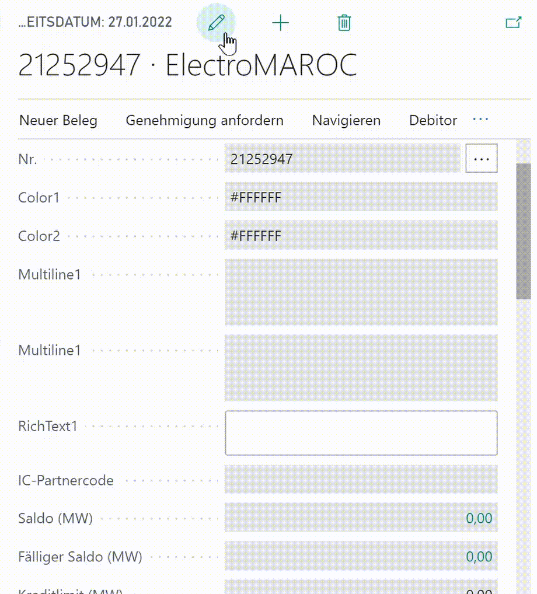

# Controladdins/ Usercontrols as Form Fields within Business Central Forms

### Usercontrols simplified
A usercontrol on a page in Business Central creates a `<div class=" control-addin-container">` as container for an iframe.
That iframe loads the _scripts_ and _stylesheets_ defined in the corresponding `controladdin`. After the content of the iframe is loaded, Busines Central executes the _startupscript_ within the iframe.

### Why are form fields suitable for the design not easy?
The iframe doesn't contain or inherit any styles from its parent. While this gives all the freedom one needs, it also does not provide a framework for designing nice form fields that match the rest of the appearance.

Instead of inserting html within the iframe, it might be an option to interact and control the DOM of the parent.

### Hiding the iframe

By default, the iframe always takes space in UI. While the starting values can be controlled within the definition of the controladdin with  `RequestedHeight` and `RequestedWidth` and other properties, the iframe (and its container) can be hidden just as well.
```javascript
const iframe = window.frameElement;
const addinContainer = iframe.parentNode;
addinContainer.style.display = "None";
```

## Examples
### Autosize multiline fields

A field has a property `multiline`. If multiline is _true_, BC renders a `<textarea rows=3>` instead of `<input type="text">`. As defined, we get a textbox with 3 rows. If the content gets longer, the height remains the same, but a scrollbar is shown.
It would be nice if the height of the textarea would automatically adjust to the content. The [Autosize](https://www.jacklmoore.com/autosize/) script already offers the function `autosize` which takes a node or a list of nodes as its single parameter.
Autosizing would be nice for all current multiline fields, which can be retrieved with `document.querySelectorAll("textarea")`.  

 and it can be turned into an controladdin:
```al
controladdin AutoSizeTextArea
{
    Scripts = 'node_modules/autosize/dist/autosize.js', 'autoSize/control.js';
    procedure Init();
}
```
The control.js script holds the procedure `Init`:

```javascript
function Init() {
```
Hide the iframe
```javascript 
    const iframe = window.frameElement; 
    const addinContainer = iframe.parentNode;
    addinContainer.style.display = "None";
```
Autosize all textareas after a short wait of 50ms
```javascript 
    setTimeout(function () {
        autosize(window.parent.document.querySelectorAll("textarea"));
    },50);
};
```
As the scripts are part of the iframe, the textareas must be looked up in the parent window `window.parent.document`!

The control can then be used within a page or page extension:

```al
layout
{
    addlast
    {
        usercontrol(AutoResize; AutoSizeTextArea)
        {
            ApplicationArea = All;
        }
    }
}

trigger OnAfterGetRecord()
begin
    CurrPage.AutoResize.Init();
end;
```

The call of Init() is triggered by OnAfterGetRecord. OnAfterGetRecord runs _before_ it is displayed to the user. Therefore Init calls autosize with an short delay.

### Color Picker
This example picks up the [Color Picker Controladdin from Erik Hougaard](https://www.youtube.com/watch?v=Lc-mEUTV8_M) and is based on the [JavaScript Color Picker](https://jscolor.com/). Erik renders the color picker in an input element added to the iframe.

The color picker script requests an `<input>` element for its operation. Normal fields in business central are already _input_ elements. The idea is now to add the usercontrol directly behind a field that holds the color value. 

As seen in the autosize example, the script can get the _addinContainer_. And the container of the value field is retrieved with `addinContainer.previousElementSibling()`.

```javascript
function Init () {
    setTimeout(function () {
        var iframe = window.frameElement;
        var addinContainer = iframe.parentNode;
        addinContainer.style.display = "None";
        var fieldContainer = addinContainer.previousElementSibling;
        var input = fieldContainer.querySelector("input");
        if (input) {
            if (!input.value || input.value ==='') 
                input.value = "#FFFFFF" ;
            new JSColor(input);

            var event = new Event('change');
            input.dispatchEvent(event);
        }
    } , 100);
}
```

Unfortunately the original code of the color picker needs also to be modified, as it now hosted within an iframe. The script uses `document` quite often.

Without modifying the script itself, a closure helps here to point document to its parent:

```javascript
(function (){
    const document = window.parent.document || document;

    /**
     * jscolor - JavaScript Color Picker
     *
     * ..rest of the script
     *
     */

})(); 
```
### CkEditor - WYSIWYG

That example is also based on video and code by Erik Hougaard: [What you see is what you get Editor in Business Central AL](https://www.youtube.com/watch?v=GI37tlcrX6Y).

The editor in Classic Mode also supports the use of a [textarea as container](https://ckeditor.com/docs/ckeditor5/latest/builds/guides/integration/saving-data.html#automatic-integration-with-html-forms). However, the content is not edited within that textarea, instead, the textarea is updated once the user submits a form. But Busines Central does not work like that.

The following approach:  
 Similar to the ColorPicker the UserControl is placed behind a field as before. This time, the field should again be created as a multiline to support line breaks. 
The resulting textarea will be detected and hidden, and a new div will be placed as a container, which will activate the ckeditor in inline mode. 

A subscription to editor's `change:data` event syncs its content to the field's textarea.

Again the original script is wrapped within a closure  so that `document` resolves to `parent.document`.

The rest is nearly copied 1:1 from Erik's code.

## Benefits



The controls are looking awesome, and I would love to see such kind of controls for my users. 

## Caveats

Obviously, controladdins are not designed for form fields in Business Central. 

The idea to place usercontrols behind fields seems to be quite nice at first. But just a personalization with moving the fields will ruin everything again. 
With "Show less" it can also happen that the field gets hidden but the usercontrol not. Then the usercontrol addresses might manipulate other fields. 

Furthermore, usercontrols cannot be manipulated via personalization. 

This limits the possible uses for add-ins, or you have to inform the users or limit the personalization.

## Final remark

I would only recommend this approach for the auto sizing of the multiline controls.

Both [ckeditor](https://ckeditor.com/) and [jscolor](https://jscolor.com) are delivered as single js files, no additional CSS files are required. That means that the scripts itself setup the styles in the form, not in the iframe. Please check also their licensing model if you consider to use them!

If usercontrol had optional caption / captionML property, in this case, the iframe could be rendered similar to a normal field, only instead of the input control the iframe would be loaded. 

Maybe this hack inspires others to experiment and come up with other potential solutions.
